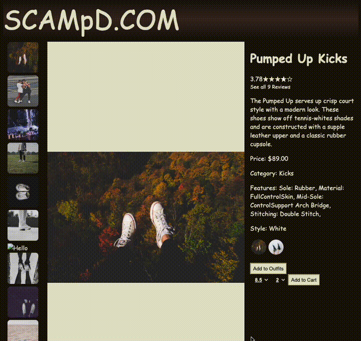
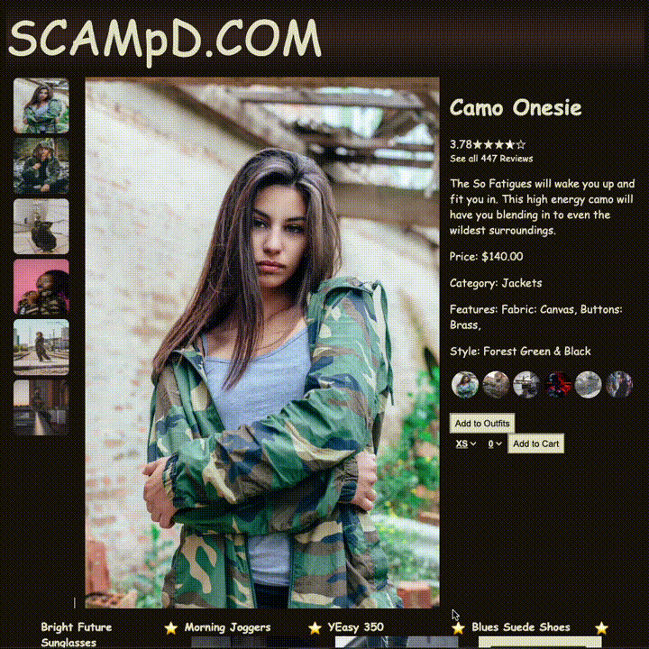
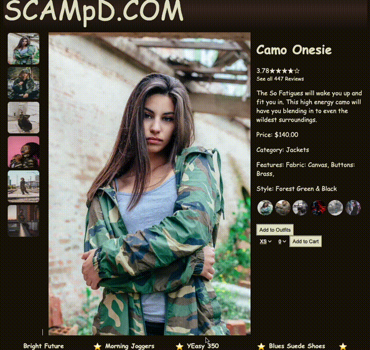
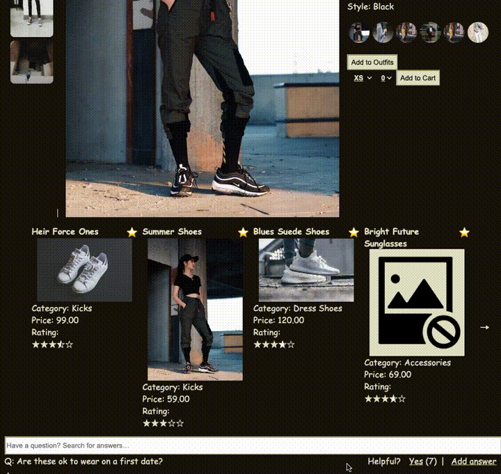
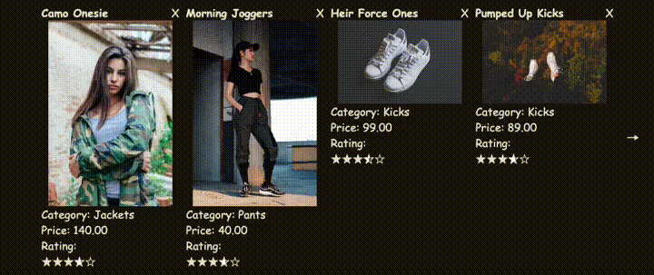
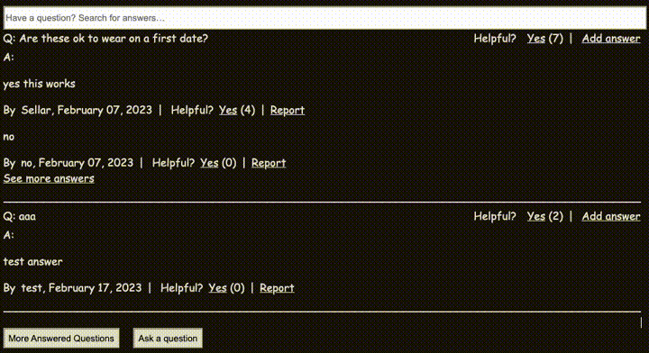
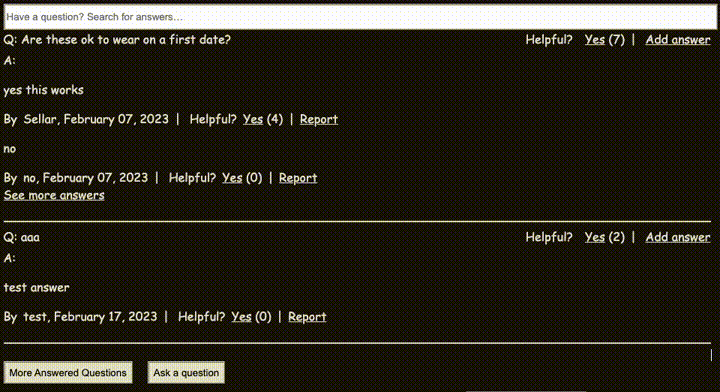
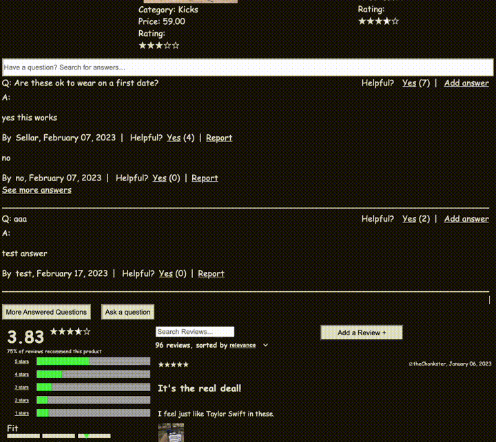
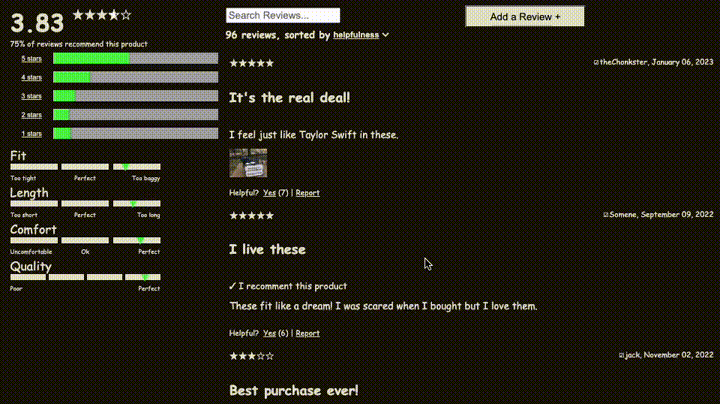
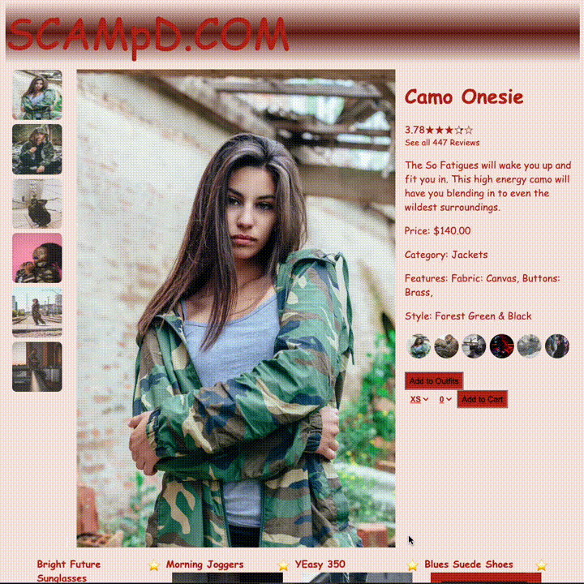

# Atelier E-Commerce Website

## Table of Contents
1. [Overview](#overview)
2. [Setup](#setup)
3. [Features](#features)
    1. [Product Overview](#product-overview)
    2. [Related Items](#related-items)
    3. [Questions & Answers](#questions--answers)
    4. [Reviews](#reviews)
    5. [Dark and Light Mode](#darklight-mode)
4. [Technologies Used](#technologies-used)
5. [Authors](#authors)
6. [License](#license)

## Overview <a id='overview'></a>
The Atelier E-Commerce Website is built with React.js and Express.js. It features a comprehensive product overview, related products carousel, user Q&A, and a reviews section to help inform shopping decisions.

## Setup <a id='setup'></a>
### Docker
```
$ git clone https://github.com/seanwong1/FEC.git
$ cd FEC
$ docker-compose up
# application viewable at http://localhost:3000
```

### macOS
```
$ brew install node git
$ git clone https://github.com/seanwong1/FEC.git
$ cd FEC
$ npm install
$ npm run build
$ npm run server-dev
# application viewable at http://localhost:3000
```

### Linux
```
$ sudo apt-get install node git
$ git clone https://github.com/seanwong1/FEC.git
$ cd FEC
$ npm install
$ npm run build
$ npm run server-dev
# application viewable at http://localhost:3000
```

## Features <a id='features'></a>
### Product Overview <a id='product-overview'></a>
- Displays product information such as
  - Product title
  - Product category
  - Product price
  - Average rating
- Switch between product styles by clicking thumbnail
  - 
- Adding to a cart with options for size and quantity
  - 
- Image gallery with ability to zoom in on an image
  - 

### Related Items <a id='related-items'></a>
- Display a carousel of related items with product information
  - Clicking a related item brings user to product overview for that item
    - 
  - Clicking the star icon brings up a comparison modal listing features for the clicked item and the item currently in overview
    - 
  - Clicking the plus icon adds the item currently in overview to an outfit list
    - 
- The outfit list stores a list of products the user designates
  - The list persists across page navigation and through browsing sessions

### Questions & Answers <a id='questions-answers'></a>
- View a list of questions asked by users, each followed by a list of answers
  - 
- Has search functionality to match text entered in input box
  - 
- User can ask or answer a question
  - 

### Reviews <a id='reviews'></a>
- Display a list of reviews with ability to sort reviews by various metrics
  - 
- Provides a breakdown of user ratings (total number of users who gave a certain rating)
- Show user feedback of certain product characteristics
  - Size
  - Width
  - Comfort
  - Quality
  - Length
  - Fit
- User can search through reviews
  - 
- Allows a user to compose a new review

### Dark/Light Mode <a id='dark_light'></a>
- Clicking header toggles dark and light modes
  - 

## Technologies Used <a id='technologies-used'></a>
FEC Retail Store was built with Node v16.17.1 and uses the following
- [React.js](https://react.dev/) - To build out front-end
- [Express.js](https://expressjs.com/) - For building out server
- [Jest.js](https://jestjs.io/) - For testing
- [Webpack.js](https://webpack.js.org/)

## Authors <a id='authors'></a>
- [David Cardona](https://github.com/clothesTooLarge)
- [Alvino Handiman](https://github.com/alvinohandiman)
- [Nick Monteleone](https://github.com/Nickmont3)
- [Sean Wong](https://github.com/seanwong1)

## License <a id='license'></a>
This code is released under the MIT License. See the LICENSE file for details.
